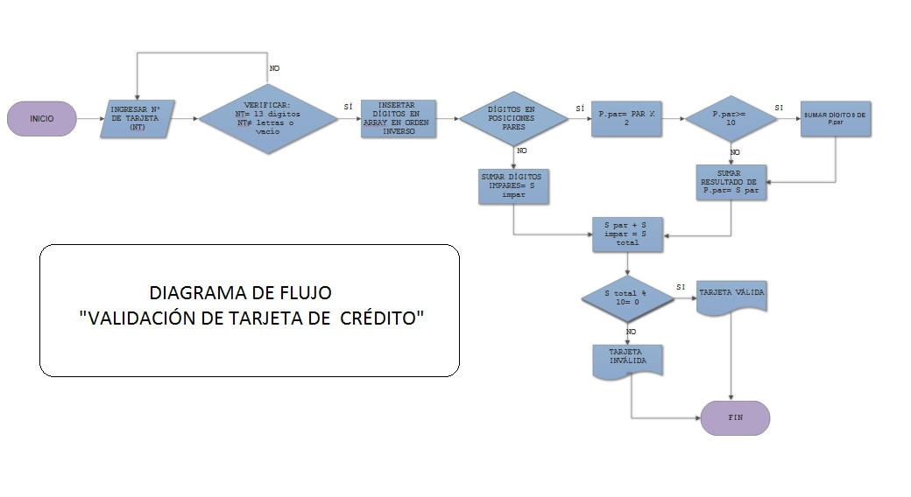

# TARJETA DE CRÉDITO VÁLIDA

En este ejercicio se debe ingresar número de una tarjeta de crédito y confirmar su validez según el algoritmo de Luhn.

### Pseudocódigo
~~~
Leer número de tarjeta
 Validar que la información ingresada cumpla los siguientes requisitos:
  >Que sea un número de 13 dígitos.
  >No deben ser letras ni otro tipo de carácter.
 Agrupar números a un array e invertir orden inicial de los dígitos ingresados.    
 Multiplicar por 2 los números en posiciones pares, si el resultado de la         >multiplicación es mayor o igual a 10 se suman dígitos del resultado.
 Sumar todos los dígitos (posiciones pares e impares)
 Aplicar módulo de 10, si el resultado es 0 la tarjeta es válida, caso contrario   
 >tarjeta inválida.
~~~
### Diagrama de flujo

